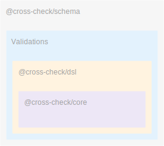

# Introduction

CrossCheck is a highly composable and ergonomic validation and schema library.

It was extracted from Conde Nast CMS system, which supports more than 100 brands with similar, but not always identical validation and schema requirements. This environment gives rise to significant extensibility requirements, so CrossCheck's primitives are designed with extensibility in mind.

All CrossCheck primitives produce well-typed, well-defined JSON objects. This is intended to allow applications to store schemas in a database or build UIs to generate them.

# Architecture

<div class=diagram>
  
</div>

CrossCheck is divided up into three libraries:

1. `@cross-check/core`, which defines the core data structures of CrossCheck validations and the core validation function. The core data structures are designed with composition in mind.
2. `@cross-check/dsl`, which provides additional conveniences on top of the core data structures. This library provides convenient composition functionality, building on top of the capabilities enabled by the core data structure.
3. `@cross-check/schema` is a schema library built on top of CrossCheck validations. It provides additional functionality such as the ability to serialize and deserialize data, the ability to have runtime modes such as "draft mode" or "readonly mode". It also has a built-in mechanism for registering data types and serializing them into your database, and built-in formatters that can produce TypeScript and GraphQL output for your schemas, and can be extended to generate an adapter to any other data modelling library you use.

Because of the way that `@cross-check/dsl` is layered on top of `@cross-check/core`, you can build validation descriptors (the core data type of CrossCheck) manually, and still use those descriptors in `@cross-check/schema`.

This enables the creation of UIs for building and composing validators and schemas that can be stored in a database without requiring every new validation rule to be checked in to source control. This is a big win for extensible systems like the one at Conde Nast.

### Validators

At the lowest level, CrossCheck allows you to define validation rules that can be applied to any value.

For example, let's say we want to define a validator that validates that a numeric input is greater than some value.

CrossCheck's validation primitive is called a "validation descriptor", and this is a descriptor for `gt(10)`:

```ts
const gt = {
  name: "gt",
  options: 10
  validator: (options) => (value) => (value > options) ? valid() : invalid("gt", 10),
};
```

Let's look more closely at the validator property, expanded out:

```ts
function validator(options: number) {
  return (value: number) => {
    if (value > options) {
      return valid();
    } else {
      return invalid("gt", 10);
    }
  }
}
```

A validator is a function that takes options, and returns a new function that takes a value. That new function is responsible for validating the value in accordance with the options, and return `valid()` if the value matches or `invalid(name, details)` if the value does not match.

Validators don't throw exceptions. Instead, they return an array of validation errors, which can be separately presented to the user as needed, and crucially, can be internationalized as needed.

All together:

```ts
import { validate, valid, invalid } from "@cross-check/core";

// Define the validation descriptor
const gt = {
  name: "gt",
  options: 10
  validator: (floor) => (value) => (value > floor) ? valid() : invalid("gt", 10),
};

// Call validate() with the value and validation descriptor, which returns an async result.
// The result will either be `[]` if there are no errors, or an array containing one or more
// errors.
await validate(5, gt);
// [{ message: { name: "gt", details: 10 }, path: [] }]

await validate(15, gt);
// []
```

When validating a single value, the `path` property is always empty. When we discuss schemas later, we'll see that the `path` property allows us to compose arbitrarily nested data structures conveniently.

If you wanted to export `gt` as a validator in your own project using the core primitive, you would probably create a module:

```ts
import { valid, invalid } from "@cross-check/core";

export function gt(floor) {
  return value => {
    if (value > floor) {
      return valid();
    } else {
      return invalid("gt", floor);
    }
  }
}
```

You could now import `gt` from another module and call `validate(value, gt)`, as we saw above. The core primitive is self-contained and easy to understand.
The conveniences in `@cross-check/dsl` simply make it a little nicer to build and compose validators.

[Learn more about @cross-check/core][core-validators]

[core-validators]: ./validators.html

### Composing Validators

There are a few main ways that you may want to compose validators:

1. "all are valid": Run both validators. Concatenate the errors and return them.
  1. Example: "check that this number is greater than 5 and less than 10"
2. "pipeline": Run the first validator. If it fails, return its errors. If it succeeds, run the second validator and return its errors.
  1. Example: "check that this value is a string, and then check that this value is a valid URL"
3. "any are valid": Run both validators. If any of them succeeds, return an empty list. Otherwise, return an error containing both lists of errors.

The `@cross-check/dsl` package makes it easy to compose validators in this way.

#### "All" Composition

Let's assume the existence of `gt` and `lt` validators. We would like to create a `range` validator that takes two parameters, a start and end position.

```ts
import { gt, lt } from "my-library";
import { compose } from "cross-check/dsl";

export function range(start, end) {
  // TODO: Move [BUILD] into @cross-check/core to allow mixing
  // and matching the builder with the core primitive
  return compose(gt(start)).andAlso(lt(end))
}
```

You can keep chaining `.andAlso()`s too. Let's say we want to make a validator that also checks to make sure that the number is an integer.

```ts
import { gt, lt, int } from "my-library";
import { compose } from "cross-check/dsl";

export function wholeNumberInRange(start, end) {
  // TODO: Move [BUILD] into @cross-check/core to allow mixing
  // and matching the builder with the core primitive
  return compose(int()).andAlso(gt(start)).andAlso(lt(end))
}
```

#### "Pipeline" Composition

Sometimes, you only want to run a subsequent validator if an earlier one succeeded. For example, let's say we want to validate that a value is a string, and only if it is a string, confirm that it's a valid URL.

The `.andThen()` composition is designed for this situation:

```ts
import { string, url } from "my-library";
import { compose } from "cross-check/dsl";

export function validURL() {
  return compose(string()).andThen(url())
}
```

[Learn more about composition using @cross-check/dsl][dsl-composition]

[Learn more about low-level composition in @cross-check/core][core-composition]

## Extensibility First

CrossCheck schemas can be **extended**. You can create a single base type that can be customized for different uses or by different brands in a larger organization.

CrossCheck schemas can be **evolved** without big-bang data migrations. Instead, data created under v1 of a schema can be viewed through the lens of v2 of the same schema. Schema evolution is baked into CrossCheck from the ground up.

CrossCheck schemas are **resilient** to old, invalid data or improperly imported data. Define fix-up rules for invalid data and CrossCheck can clean up broken data on the fly. No need to run migrations against all your old data or force every API client to harden itself against the possibility of broken data.

## Important Schema Features

- **Draft Mode**: Defining a schema automatically generates a "draft schema", to make it easier to save in-progress work that doesn't yet satisfy the strict schema requirements.
- **Rich Types**: Any concept that you can write a validation function for can be used as a schema type: URL, single word string, Date formatted as 8601, etc.
- **Composable Types**: Put types inside of lists or dictionaries, and get errors when the constituent parts are invalid.
- **Custom Types**: Turn any CrossCheck validator into a CrossCheck schema type.
- **TypeScript Support**: Turn any CrossCheck schema into a TypeScript interface.
- **Pretty Printing**: Use the CrossCheck formatter API to turn your schema into the format expected by another library. Need to generate MobX classes? Want to generate GraphQL schemas? No problem!

## Important Validator Features

- **Value-based**: Validate values, not just objects ("validate that this value is a titlecase string")
- **Async**: Validators can be async ("validate that this is a unique email address")
- **No exceptions**: Validators produce an error list and don't throw exceptions
- **Easy to Localize**: Validation errors are structured data, not an English string (so errors can be easily localized)
- **Composable**: Validators can be pipelined: "this type should not be null, and then it should be a string, and then it should be a valid email". Sub-validators can be reused, making it easier to build up larger validations and ensuring that errors have a consistent structure.
- **Framework Friendly**: Validation rules are agnostic to how properties are looked up inside of object (so they naturally support Immutable.js or other APIs that look up properties using `.get` or similar)
- **Pretty Printing**: CrossCheck can pretty-print validators for documentation and debugging
- A single validator can produce multiple errors
